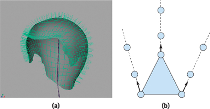
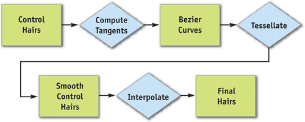
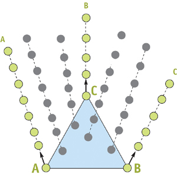

# 前言

因为最近正在研究物理头发，想起GPU Gems 2上有一篇NVIDIA的文章，讲了物理头发的一种实现，所以就找来研究一下。
一般常见的头发都是用3D建模软件制作的，然后分成几个部分，然后每部分绑上骨骼。游戏运行中使用Spring来模拟。
但是为了模拟和绘制更加逼真的头发，就需要绘制大量的发丝，而每个发丝都是一个单独的图元。
Nalu中使用了4095根发丝（每根发丝都是由数个顶点组成的曲线）来绘制头发，共计由123000个顶点。因为无法实时的对所有的顶点进行动力学模拟和碰撞检测，所以原文引入了受控发丝的概念。总共有几百根受控发丝，经过一些计算之后，再对这些受控发丝进行插值，生成整个头发。

原文主要分为三个部分：
1. 头发几何体的创建
2. 动力学模拟和碰撞检测
3. 头发的着色

本文也按照这三部分简单的介绍一下物理头发的实现。

# 头发几何体的创建

首先需要在3D建模软件中创建一个“头皮”模型，这个头皮在渲染时不可见的。受控发丝就是从头皮顶点开始，沿着法线“生长”出来的。所谓“生长”，就是从头皮顶点开始，添加N个顶点，形成一个曲线。不过这些顶点并不是等距的，离头皮越远，两个顶点的距离越大（即线段越长）。

生成受控发丝之后，就可以用它们进行动力学模拟和碰撞检测，来生成程序性动画。不过如果为这些动画添加适当的人为控制的话，会得到更加逼真的效果（可惜原文中并没有讲如何添加人为控制和添加什么样的人为控制）。

生成的控制发丝，首先计算切线，（和顶点一起）作为贝塞尔曲线的控制点，然后（根据贝塞尔曲线）进行曲面细分（Tessellation），得到了平滑的曲线，再对这些平滑曲线进行插值，增加头发的密度。最后，将这些顶点一起传给引擎进行渲染。

流程图：

示意图：

原文使用曲面细分将曲线的顶点数从7增加到了36个，但是并没有提及是按照什么样的规则增加的。因为“植发”的时候，曲线顶点不是等距的，所以个人推测，这里细分的时候，应该也不是均匀细分的，即离头皮越远，细分度越大（硬件曲面细分是在Direct11/OpenGL4.0的新特性，Direct11/OpenGL4.0是2009/2010年发布的，而Nalu demo是2004年发布的，所以这里是软件的曲面细分）。

为了增加头发的密度，需要进行插值来生成更多的曲线。三角形的每个顶点对应一条曲线（控制发丝），使用重心坐标系，对三角形的三条曲线进行插值，新生成的曲线的顶点数量跟原来的相同。

关于重心坐标系：设三个系数b0、b1、b2，都在[0,1]范围内，且b0+b1+b2=1。对于一个三角形T的三个顶点P0、P1、P2，有

P = b0P0 + b1P1 + b2P2

则，P在三角形内部或边上。

其中，(b0, b1, b2)称为点P（在三角形T的）重心坐标系下的位置。

# 动力学模拟和碰撞检测

# 头发的着色

