# 前言

因为最近正在研究物理头发，想起GPU Gems 2上有一篇NVIDIA的文章，讲了物理头发的一种实现，所以就找来研究一下。

一般常见的头发都是用3D建模软件制作的，然后分成几个部分，为每部分绑上骨骼，游戏运行中以骨骼为对象进行物理模拟。

但是为了模拟和绘制更加逼真的头发，就需要绘制大量的发丝，而每个发丝都是一个单独的图元。
Nalu中使用了4095根发丝（每根发丝都是由数个顶点组成的曲线）来绘制头发，共计由123000个顶点。因为无法实时的对所有顶点进行动力学模拟和碰撞检测，所以原文引入了受控发丝的概念。受控发丝的数量有几百根，经过一系列计算之后，再对这些受控发丝进行插值，生成整个头发。


原文主要分为三个部分：
1. 几何体
2. 物理模拟
3. 着色

其中几何体是后面两个部分的基础，而物理和着色则是两个相对独立的部分。

本文也按照这三部分简单的介绍一下物理头发的实现。

# 几何体

为了创建头发的几何体，我们需要一个辅助模型。首先要在3D建模软件中创建一个“头皮”模型，但是这个头皮不会被渲染出来。受控发丝就是从头皮顶点开始，沿着法线“生长”出来的。所谓“生长”，就是从头皮顶点开始，添加N个顶点，形成一个曲线（折线）。不过这些顶点并不是等距的，离头皮越远，两个顶点的距离越大（即线段越长）。


生成受控发丝之后，就可以用它们进行动力学模拟和碰撞检测，来生成程序性动画。不过如果为这些动画添加适当的人为控制的话，会得到更加逼真的效果（可惜原文中并没有讲如何添加人为控制和添加什么样的人为控制）。

生成的控制发丝，首先计算切线，（和顶点一起）作为贝塞尔曲线的控制点，然后（根据贝塞尔曲线）进行曲面细分（Tessellation），得到了平滑的曲线，再对这些平滑曲线进行插值，增加头发的密度。最后，将这些顶点一起传给引擎进行渲染。

流程图：


示意图：

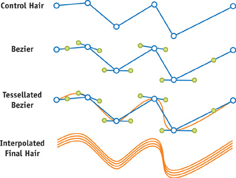

原文使用曲面细分将曲线的顶点数从7增加到了36个，但是并没有提及是按照什么样的规则增加的。因为“植发”的时候，曲线顶点不是等距的，所以个人推测，这里细分的时候，应该也不是均匀细分的，即离头皮越远，细分度越大（硬件曲面细分是在Direct11/OpenGL4.0的新特性，Direct11/OpenGL4.0是2009/2010年发布的，而Nalu demo是2004年发布的，所以这里是NVIDA自己实现的曲面细分）。


为了增加头发的密度，需要进行插值来生成更多的曲线。三角形的每个顶点对应一条曲线（控制发丝），使用重心坐标系计算新发丝的根部顶点，对三角形的三条曲线进行插值，新生成的曲线的顶点数量跟原来的相同。


**重心坐标系**

设三个系数b0、b1、b2，都在[0,1]范围内，且b0+b1+b2=1。对于一个三角形T的三个顶点P0、P1、P2，有

P = b0P0 + b1P1 + b2P2

则，P在三角形内部或边上。

其中，(b0, b1, b2)称为点P（在三角形T的）重心坐标系下的位置。


# 物理模拟

## 动力学模拟

Nalu的头发动力学是基于粒子系统的，每个控制发丝的顶点被当做一个粒子。原文使用了Verlet积分来计算粒子的运动。

**Verlet积分**

Verlet积分是用来求解牛顿运动方程的。对于一个粒子：


其中x为粒子当前位置，Δt为两个时刻的时间差，x* 为上一时刻的位置，x'为下一刻的位置，a为加速度。

但是，使用Verlet积分模拟粒子运动的时候，因为只是对单个粒子进行模拟，并没有（同一条曲线上的）其他粒子的信息，所以头发的长度会发生变化。这里就要为头发增加约束，当两个相邻的粒子太近的时候就拉伸线段，太远的时候就收缩线段。然而，为了同时满足多个约束，就需要多次迭代收敛到期望的结果。

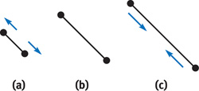

## 碰撞检测

为了防止头发穿过头部和身体，就需要进行碰撞检测。原文中使用了一套球体，作为角色模型的碰撞几何体。

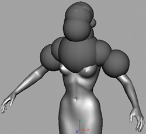

而对于受控发丝，不能简单的使用点来检测对象，于是原文使用了“珍珠结构”，将顶点视为一个球体。由此，就将问题转换为了球体与球体之间的碰撞关系。


**彩蛋——鱼鳍**

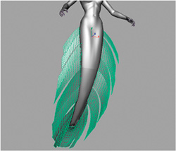

原文还爆出了一个彩蛋，这里的动力学模拟不但可以模拟头发的运动，还可以模拟鱼鳍（布料）。本身鱼鳍是蒙皮的，由骨骼来控制，但是这样只能做刚体变换，并不能发生柔软变形。原文希望鱼鳍的根部更加的硬（更多的刚体变换），末梢更加的柔软（更多的物理模拟），而不是完全的物理模拟，所以为鱼鳍添加了一个权重映射图，来指定鱼鳍上的每个顶点混合了多少比率的物理模拟。

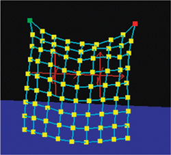

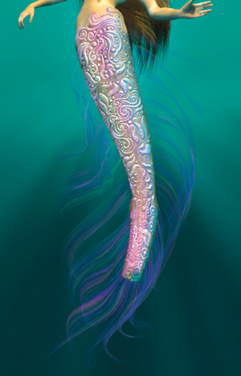

# 着色

原文中，头发的着色分为两个部分：反射和自阴影。

## 发射

原文中使用了[Marschner et al. 2003]中介绍的反射模型。
[Marschner et al. 2003]将发丝当做一个半透明的椭圆柱体，柱体的侧面是锯齿状的表面。

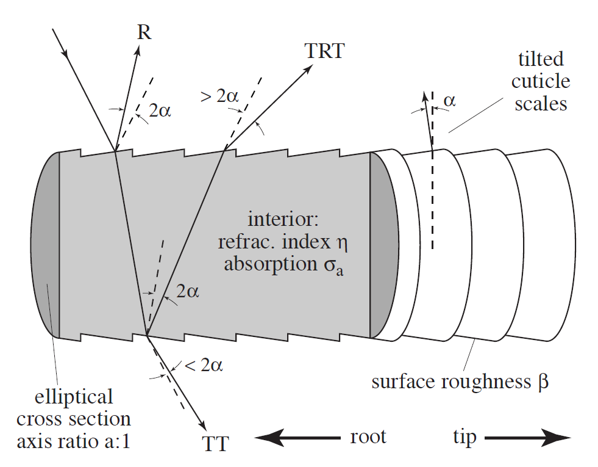

使用一个双向散射方程来描述头发的散射率（出射方向的单位辐射度与入射方向的单位照度的比率）。

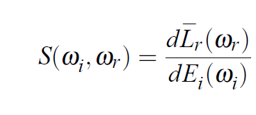

其中ω<sub>i</sub>为入射方向ω<sub>r</sub>为出射方向，这两个方向分别使用球坐标系(θ,φ)表示。这是一个四维度的方程，无法得到GPU的支持。
而且最终需要对于所有的ω<sub>i</sub>进行积分来计算ω<sub>r</sub>上的辐射度。


所以需要对整个计算过程进行简化，才能在计算机上运算。

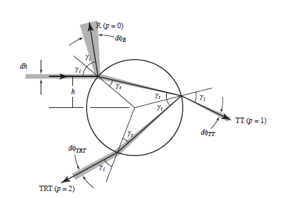

为了简化，只计算对结果贡献最多的三条光线路径。
1. R：直接反射
2. TT：折射进入发丝再折射出来
3. TRT：折射进入发丝，经过内部反射，再折射出来

然后再将每条路径上的散射方程简化为两个方程的乘积，最后得到：


其中：
1. M使用了高斯分布来实现，表明反射只发生在高光椎体范围内。
2. θ<sub>h</sub>=θ<sub>i</sub>=θ<sub>o</sub>。
3. N代表了方位角散射方程。
4. θ<sub>d</sub>表示出射光线与投影平面的倾角
5. η'表示折射指数。
6. cos<sup>2</sup>θ<sub>d</sub>将高光椎体在的投影立体角纳入计算。

具体推导和计算请见参考文献3。

为了能在着色器里计算散射效果，使用了lookup纹理来保存这些中间值。计算cosθ<sub>d</sub>并对三条路径分别计算M和N，将它们存到纹理里。

其中M<sub>R</sub>、M<sub>TT</sub>、M<sub>TRT</sub>都为单通道数据，将它们和cosθ<sub>d</sub>一起存到第一张纹理中。
N<sub>R</sub>为单通道，N<sub>TT</sub>、N<sub>TRT</sub>为三通道，原文假设N<sub>TT</sub>=N<sub>TRT</sub>，这样就可以把它们存到第二张纹理中。

但实际在最终实现上，却与原文稍有不同。如一下代码所示：

VS部分代码

```
  /* Compute longitudinal angles */
  float2 uv1;
  uv1.x = dot(objLightDir, objTangent);
  uv1.y = dot(objEyeDir, objTangent);
  v2f.angles.xy = 0.5 + 0.5*uv1;

  /* Compute the azimuthal angle */
  float3 lightPerp = objLightDir - uv1.x * objTangent;  
  float3 eyePerp = objEyeDir - uv1.y * objTangent;  
  float cosPhi = dot(eyePerp, lightPerp) * rsqrt(dot(eyePerp, eyePerp) * dot(lightPerp, lightPerp));
  v2f.angles.z = 0.5*cosPhi + 0.5;
```

FS部分代码

```
  /* Compute the longitudinal reflectance component */
  half2 uv1 = v2f.angles.xy;
  half4 m = h4tex2D(lookup1fixed, uv1);

  /* Compute the azimuthal reflectance component */
  half2 uv2;
  uv2.x = m.w;
  uv2.y = v2f.angles.z;
  half4 ntt = h4tex2D(lookup2fixed, uv2);

  /* Combine longitudinal and azimuthal reflectance */ 
  half3 lighting;
  lighting = (m.r * ntt.a * Rcol.r).xxx;	  // Primary highlight  
  lighting += m.b * ntt.rgb * TTcol.r;      // Transmittance (using MTRT instead of MTT)
  lighting += v2f.diffuseColor.rgb;	        // Diffuse lighting
```

散射效果：

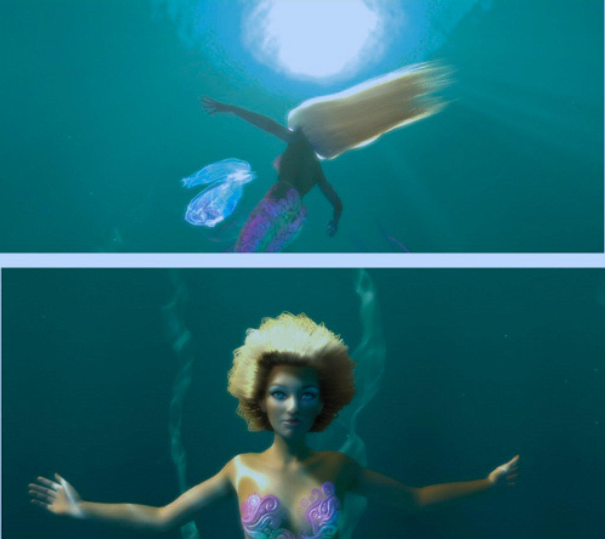

**伪彩蛋——实体几何**

原文中提到了，除了使用折线作为反射模型的几何体之外，也可以将这种方法扩展到实体几何上。使用表面的一个主切线，而不是线段的切线，来参与计算。并且使用(wrap+dot(N,L))/(1+wrap)来引入自遮挡效果。其中N为表面法线，L为光的方向，wrap是一个[0,1]之间的参数，用来调整光与表面的交互。

## 自阴影

在传统的基于深度的阴影映射技术中，首先以光源的方向为观察方向绘制深度图，然后在实际绘制的时候，对深度图进行采样，来计算像素的阴影。但是，因为是离散采样，对于头发这种情况（有很多小的图元组成的密集体积对象），阴影映射会产生严重的走样。并且，在深度测试的时候，只会有两种结果（是/否），所以阴影映射无法呈现散射的半透明效果。

于是原文使用了透明度阴影映射的技术：


T表示光线的透射率，σ表示当前点(x,y,z)的不透明（厚）度，r表示消光系数，表示在当前点上单位距离上光线被吸收的概率。

但是这是一个三维度的函数。所以，原文将灯光空间在Z轴上等分为N层，选取了N个离散的z值来作为分割平面，中间的σ值使用下面的方法进行插值。


其中z<sub>i</sub> < z < z<sub>i+1</sub>。

这里N=16，z<sub>0</sub>在灯光空间的近切面上，z<sub>15</sub>在灯光空间的远切面上。并将空间进行等分。

dz=(z<sub>15</sub>-z<sub>0</sub>)/16

z<sub>i</sub>=z<sub>0</sub>+idz。

需要注意的是，因为在头发体积对象之外时，r=0，所以σ(x,y,z<sub>0</sub>)恒等于0。于是只需要将z=z<sub>1</sub>...z<sub>15</sub>对应的σ值（纹理中）。

具体做法：在灯光空间中遍历两个深度值之间的发丝，计算消光系数，并累计起来得到σ(x,y,z<sub>i</sub>)。

对于每个σ(x,y,z<sub>i</sub>)，可以渲染到纹理的一个通道里，然后使用MRT技术，一次将所有的σ纹理绘制出来。

最后在着色器里对这些纹理进行采样，并计算阴影值。


VS部分代码

```
// depth1 contains z0...z3, inverseDeltaD = 1/dz.
v2f.OSM1weight = max(0.0.xxxx, 1- abs(dist - depth1) * inverseDeltaD);
v2f.OSM2weight = max(0.0.xxxx, 1- abs(dist - depth2) * inverseDeltaD);
v2f.OSM3weight = max(0.0.xxxx, 1- abs(dist - depth3) * inverseDeltaD);
v2f.OSM4weight = max(0.0.xxxx, 1- abs(dist - depth4) * inverseDeltaD);
```

FS部分代码

```
／* Compute the total density */
half density = 0;
density  = dot(h4tex2D(OSM1, v2f.shadowCoord.xy), v2f.OSM1weight);
density += dot(h4tex2D(OSM2, v2f.shadowCoord.xy), v2f.OSM2weight);
density += dot(h4tex2D(OSM3, v2f.shadowCoord.xy), v2f.OSM3weight);
density += dot(h4tex2D(OSM4, v2f.shadowCoord.xy), v2f.OSM4weight);
half shadow = exp(-5.5 * density);
```

无阴影和有阴影的头发的对比图：

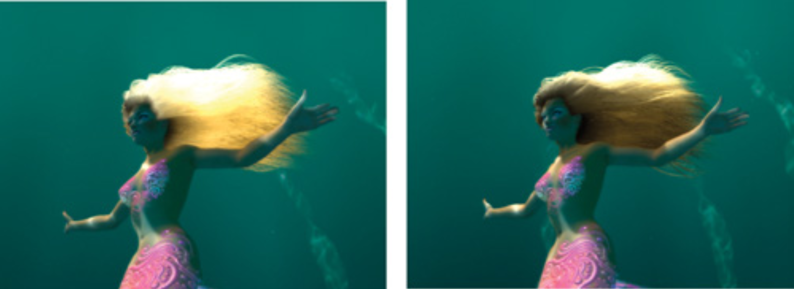

# 总结与展望

原文的总结与展望说了很多高大上的话，毕竟是NVIDIA。作为一个小彩笔，我只希望我早日能做出来适用于手机平台的物理毛发。


# 参考文献 
1. Hair Animation and Rendering in the Nalu Demo, GPU Gems 2
2. Advanced Character Physics
3. Light Scattering from Human Hair Fibers
4. Opacity Shadow Maps
5. Real-Time Rendering
6. https://en.wikipedia.org/wiki/Verlet_integration
7. http://www.cnblogs.com/miloyip/archive/2011/06/14/alice_madness_returns_hair.html
8. https://www.nvidia.cn/coolstuff/demos#!/geforce-6/nalu