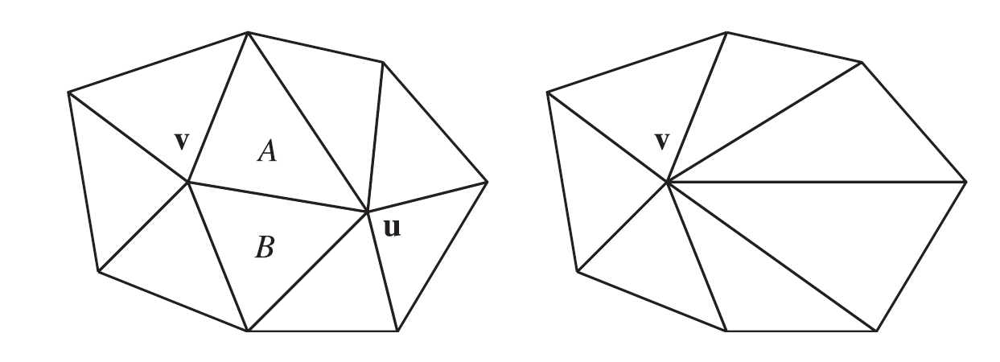

# 网格简化

在游戏开发中，我们有时需要对美术同学给出的模型进行简化。目的是在减少面数的同时，尽可能的维持模型的外观。这种技术可以用在LOD（Levels of Details）上，当模型与摄像机的距离大于一定值之后，使用面数较少的模型来代替高模，这样可以减少GPU带宽消耗和渲染压力。

简化分为三种：
1. 静态的
2. 动态的
3. 视角依赖的

通常情况下，我们会让美术提供面数不同的几个模型，或者我们使用工具对高模进行减面并存成多个Mesh，然后在游戏运行的时候，根据模型与摄像机的位置关系，动态的替换Mesh。这是一种静态的方法。

本文将讨论一种动态的网格简化算法。这种算法的好处在于，美术只需要提供一个高模，程序便可以自动的生成量级不同的低模。

原文链接：[A Simple, Fast, and Effective Polygon Reduction Algorithm](http://dev.gameres.com/Program/Visual/3D/PolygonReduction.pdf)（感谢UWA答主马古斯提供的文章和思路）

# 三角边坍缩

这里使用了三角边坍缩的方法来进行网格简化，将两个顶点合并成一个顶点，如图1所示。

 

对于要坍缩的边uv，删除这条边两侧的面A和面B，用v来替换u，连接v和u的其他邻居点，并删除u。

对于一个实体模型（具有封闭的边界，根据边界可以将空间分为模型内部和模型外部两部分），一次坍缩，可以移除两个三角面，三条边和一个顶点。通过反复的迭代，最终就会使模型简化到预期的面数。

但是如何选择要移除的点，才能尽可能小的影响模型的外观呢？这里就需要用到坍缩代价计算公式。

[comment]: <> (cost(u,v)=||u-v|| \times \max \limits_{f \in Tu} \{\min \limits_{n \in Tuv}\{(1-f.normal \cdot n.normal) \div 2\}\})

%3D%7C%7Cu-v%7C%7C%20%5Ctimes%20%5Cmax%20%5Climits_%7Bf%20%5Cin%20Tu%7D%20%5C%7B%5Cmin%20%5Climits_%7Bn%20%5Cin%20Tuv%7D%5C%7B(1-f.normal%20%5Ccdot%20n.normal)%20%5Cdiv%202%5C%7D%5C%7D&preview=true)

其中Tu是包含顶点u的三角形的集合，Tuv是同时包含顶点u和顶点v的三角形的集合。

上面公式表示将u坍缩到v（移除u）所需要的代价。第一部分是边的长度，直观上讲，在模型简化过程中，小的细节应该优先被移除。第二部分是u点周围的曲率变化，理论上曲率变化越小的顶点，所处的区域越平坦，应该优先被移除。需要注意的是，将u坍缩到v和将v坍缩到u的代价可能不一样。

通过这个公式，我们就可以对每个点计算坍缩到其相邻点的代价，然后选取坍缩代价最小的相邻点作为其坍缩目标。

# 实现细节

根据以上的描述，可以将实现分为以下步骤：
1. 搜集顶点、三角面和三角边的关系。
2. 计算坍缩代价和坍缩目标，并排序。
3. 替换坍缩代价最小的点，并重新计算相邻点的坍缩代价和坍缩目标，更新有序列表。
4. 判断当前顶点数量是否大于目标数量，是则重复第3步。

显然，在游戏中实时的进行以上步骤是不现实的，尤其是第2步，相当于对整个模型的所有顶点遍历了多次。所以，要将它拆分成离线烘焙和运行时两个部分。

## 离线烘焙

离线烘焙需要保存两个int数组：permutation和vertex_map。

步骤：
1. 收集顶点信息：主要是顶点位置和index。
2. 收集三角面信息：获取每个三角面所包含的三个顶点，并计算法线（用于计算曲率）。同时，将该三角面加入顶点的三角面列表，并将每个顶点加入另外两个顶点的邻居列表中去。
3. 计算顶点与其邻居点的坍缩代价，选择坍缩代价最小的邻居点作为坍缩目标。
4. 依据坍缩代价对所有的顶点进行排序。
5. 替换坍缩代价最小的顶点：获取坍缩代价最小的顶点u及其坍缩目标顶点v，遍历u的三角面列表，如果包含v就删除该三角面，否则将u替换为v。重新计算u的邻居点的坍缩代价和坍缩目标并更新列表。
6. 令permutation[u.index] = 当前顶点数量，令vertex_map[u.index] = v.index (如果没有坍缩目标，则赋值为-1)。
7. 判断当前顶点总数是否大于0，是则重复第5步。

permutation保存了每个顶点被移除的倒数次序（1是最后被移除的，最大的是第一个被移除的），vertex_map保存了每个顶点的坍缩目标的位置。

## 运行时

输入需要绘制的最大顶点数量n。

步骤：
1. 遍历三角面
	1. 获得当前三角面的三个顶点的index，即idx0、idx1和idx2。
	2. 如果permutation[idx0] >= n，则idx0=vertex_map[idx0]，否则执行1.5。
	3. 如果idx0==-1 or idx1 == idx0 or idx2 == idx0，该三角面不参与绘制。同理映射并判断idx1和idx2。
	4. 返回1.1。
	5. 当前三角面加入绘制列表。
2. 根据三角面的数据，整理顶点属性。

此外，网格的原始信息会被保留，在游戏运行期间，就可以在任意LOD上自由切换。

# 细节优化

为了更好的性能和较为好的外观，本文还对上面的步骤进行了一下优化：
1. 最小堆算法：离线烘焙第4步中，被移除点的邻居点需要重新计算坍缩代价，也就意味着坍缩列表也会动态变化。所以这里使用最小优先队列（最小堆）来保存顶点和坍缩代价，并且动态调整顶点顺序。（详参:算法导论第3版第6章）
2. 删除不用顶点：为了减少带宽消耗，并提高GPU的Cache命中率，在运行时第2步中，要根据三角面的数据对Mesh的顶点数组（还有uv、uv2、colors、normals、tangents、boneWeights等）和三角面数组进行重新排列。（详参后文的完整实现）
3. 边界点处理：实际操作中，会有两种比较麻烦的情况：一种是不闭合的三角面，例如飘带、披风等。还有一种是两个点拥有相同的位置，但是不同的uv或normal，例如Unity3D的Sphere是有一条接缝的。如果不考虑这两种情况，坍缩的时候，因为没有找到正确的坍缩目标来代替原顶点，就会出现镂空、破损的现象。针对这种处理，在计算坍缩消耗的时候，会将这些边缘点的曲率设为最大值（有待进一步实验）。
4. 内存优化禁术：为了避免每次新建Mesh的vertices等数组，目前使用unsafe的手段来修改数组的大小（感谢UWA答主lujian提供的禁术）。
5. JobSystem：离线烘焙中使用了JobSystem来加速烘焙。

# 完整实现

https://github.com/ecidevilin/UnityMeshSimplify

# 参考文献

1. [A Simple, Fast, and Effective Polygon Reduction Algorithm](http://dev.gameres.com/Program/Visual/3D/PolygonReduction.pdf)
2. [BunnyLod](https://download.csdn.net/download/ecidevilin/10729117)
3. [MeshSimplify](https://assetstore.unity.com/packages/tools/modeling/mesh-simplify-43658)
4. [UWA问答：List的ToArray有什么办法能避免内存分配吗？]https://answer.uwa4d.com/question/5b1f437c09749726e4188e5f
5. Real-Time Rendering, 3rd Edition
6. 算法导论