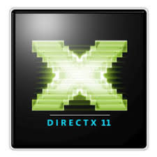
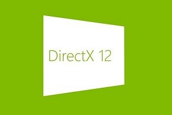
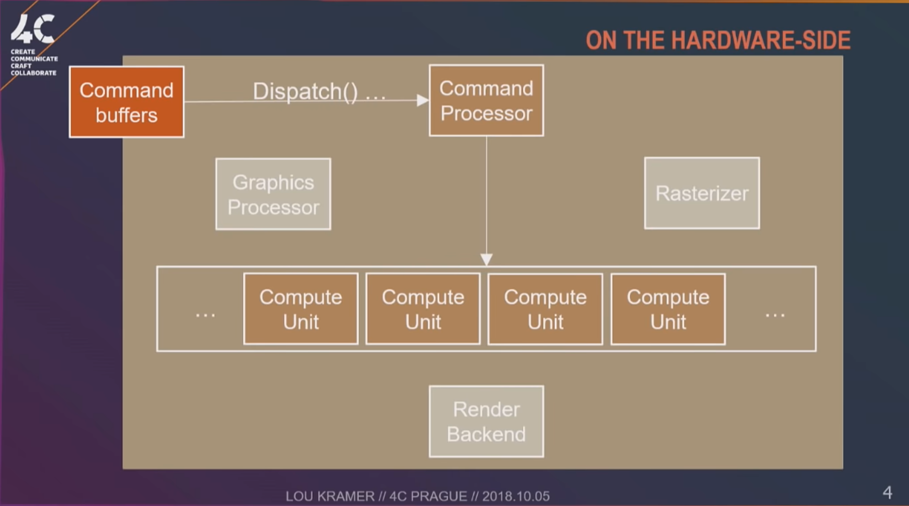
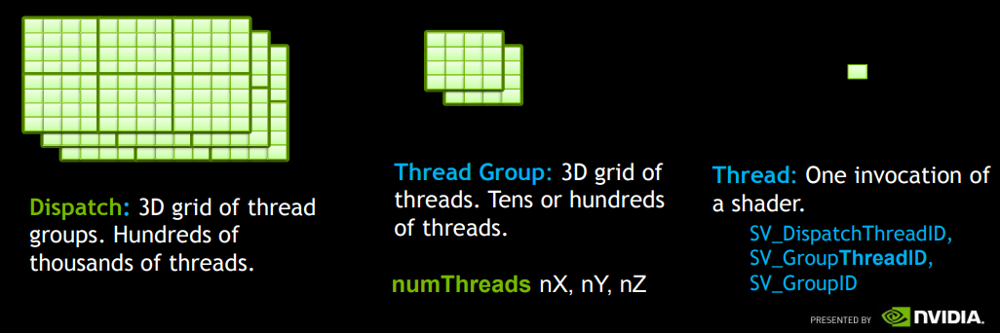
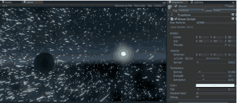
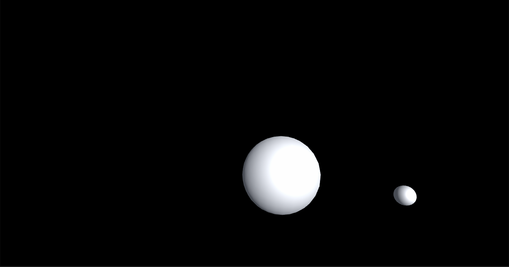
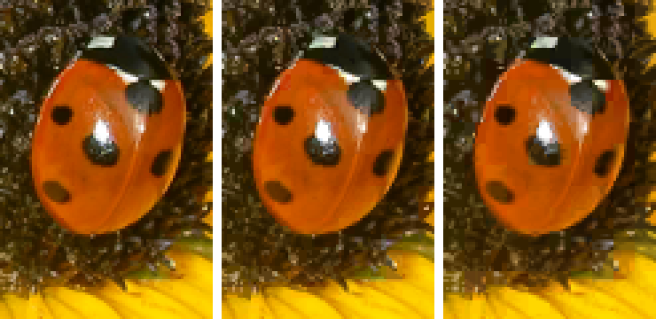
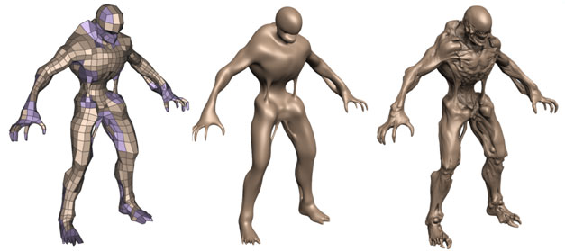

<!-- $theme: default -->

Compute Shader 入门精要
===

# 

##### Optimize your game using compute shader

###### **凯奥斯**
<!--
page_number: true
-->

---

Compute Shader 入门精要
===

- 概念
- 语法
- 用途
<!--
-->

---

概念
===
## GPGPU（General Purpose Computing on GPU）

# 
<!-- Compute Shader是一种GPGPU技术，也就是利用GPU进行通用计算的技术
-->

---
概念
===
## CPU是基于低延迟的设计
# 

<!--CPU擅长逻辑控制和串行的运算。
有很强大算术逻辑单元，减少操作延迟
巨大的cache，内存访问延迟大，空间换时间
复杂的控制，使用分支预测来减少分支延迟，使用数据转发减少数据延迟
-->

---
概念
===
## GPU是基于大吞吐量的设计
# 

<!--GPU适用于计算密集型和易于并发的程序。
小的cache，用来促进吞吐量
简单的控制，没有分支预测和数据转发
高效节能的ALU，很多延迟很长的ALU，但是为了高吞吐量被重度管线化
（需要大量的线程来容忍延迟）开启大量的线程，可以降低延迟
-->

---
概念
===
## 支持Compute Shader的图形API
#   
#  
#  
<!--DX虽然从10开始支持Compute Shader/Direct Compute，但是比较受限。
11支持了更强大的Compute Shader
所以我们一般在Unity中使用CS，还是要求shader model 5/shader target4.5
OpenGL从4.3开始支持CS，但是MacOSX不支持4.3
ES从3.1开始支持CS
Metal和Vulkan都支持CS
另外PS4和Xbox one也支持CS
-->

---
概念
===
## Compute管线与图像管线的对比
# 
<!--
其实还少一个Output Merger Stage
GPU Rendering Pipeline https://github.com/ecidevilin/Blogs/blob/master/IntroTo3DGPWithDX/Tessellation/pic/pipeline.jpg
-->

---
概念
===
## 渲染管线（硬件端）
# 
<!--
-->

---
概念
===
## 计算管线（硬件端）
# 

<!--Compute Shader可以在不通过渲染管线的情况下，利用GPU完成一些与图像渲染不直接相关的工作。这样就可以降低硬件的overhead。
-->

---
语法
===
## kernel
``` ShaderLab
// test.compute
#pragma kernel FillWithRed

RWTexture2D<float4> res;

[numthreads(8,8,1)]
void FillWithRed (uint3 dtid : SV_DispatchThreadID)
{
    res[dtid.xy] = float4(1,0,0,1);
}

```
<!--
一个简单的Compute Shader示例
-->

---
语法
===
## Dispatch
``` C#
public void Dispatch(int kernelIndex, 
	int threadGroupsX, 
	int threadGroupsY, 
    int threadGroupsZ);
```
<!--kernelIndex来源于Metal API的思路，可以在一个资源文件里定义不同的kernel方法，公用一些代码，同时也可以做到相对独立
threadGroupsXYZ代表线程组的数量
关于线程组，我们可以看下面这张图
-->


---
语法
===
## numthreads
# 
<!--
左边代表了一个Dispatch调用的总线程数量
右边代表了一个线程
而中间代表了一个线程组
如图所示
Dispatch 3x2x3
numthreads 4x4x2

这样做的好处一个是可以利用gpu的warp/wavefront/EU-thread
另外，可以用来处理多种多样的图像压缩和解压缩；local size可以作为图像数据的一个block的大小（例如8x8）,group数量可以是图像的尺寸除以块的尺寸。每个块被当作一个单独的work group来处理。
-->

---
语法
===
# 
<!--
Dispatch 5x3x2
numthreads 10x8x3
这些一般是用来作为索引来获取Buffer或Texture里的数据
-->

---
语法
===
## Buffer & Texture
| GPU Side | CPU Side |
|-----|-----|
|\*StructuredBuffer|ComputeBuffer|
|Texture\*D|Texture|
|RWTexture\*D|RenderTexture|
<!--
StructuredBuffer还包括
RWStructuredBuffer
RWStructuredBuffer with counter
(RW)ByteAddressBuffer
AppendStructuredBuffer
ConsumeStructuredBuffer
-->

---
语法
===
## groupshared

使用groupshared可以将一个变量标记为组内共享。
<!--
例如，我们可以在forward+/Deferred管线里使用compute shader对点光源进行剔除。
 https://github.com/jpvanoosten/VolumeTiledForwardShading

-->

---
语法
===
## Barrier
当我们在不同线程访问同一个资源的时候，我们需要使用barrier来进行阻塞。
```
GroupMemoryBarrier 
GroupMemoryBarrierWithGroupSync  
DeviceMemoryBarrier
DeviceMemoryBarrierWithGroupSync 
AllMemoryBarrier 
AllMemoryBarrierWithGroupSync
```
<!--
GroupMemoryBarrier用于等待对groupshared变量的访问
DeviceMemoryBarrier用于等待对texture或buffer的访问
AllMemoryBarrier是以上两者的和
WithGroupSync版本是需要同步本组内所有线程到达当前指令
-->

---
语法
===
## Interlocked
原子操作，不会被线程调度机制打断。
```
InterlockedAdd
InterlockedAnd
InterlockedCompareExchange
InterlockedCompareStore
InterlockedExchange
InterlockedMax
InterlockedMin
InterlockedOr
InterlockedXor
```
<!--
例如可以用于计算颜色直方图
https://github.com/StayGrizzly/GentiiVRJam/blob/6e88c6ef6e2ea910884c50002f7fca02910fc700/GentiiVRJam/Assets/Standard%20Assets/Effects/CinematicEffects(BETA)/TonemappingColorGrading/Resources/HistogramCompute.compute
-->


---
语法
===
## 平台差异
- 如果**数组越界**，DX上会返回0，其它平台会出错。
- 如果变量名与关键字/内置库函数**重名**，DX没有影响，其他平台会出错。
- 如果StructuredBuffer内结构的显存布局要与**内存布局不一致**，DX可能会转换，其他平台会出错。
- **未初始化**的Buffer或Texture，在某些平台上会全部是0，但是另外一些可能是任意值，甚至是NaN。
- Metal不支持**对纹理的原子操作**，不支持对buffer调用**GetDimensions**。
- OpenGL ES 3.1在一个ComputeShader里**至少支持4个buffer**（所以，我们需要将相关联的数据定义为结构体）。
- 在渲染管线中，部分号称支持es3.1+的Android手机**只支持在片元着色器内访问StructuredBuffer**。
<!--
-->

---
语法
===
## 性能
- 尽量减少Group之间的交互
- GPU一次调用64（AMD）或32（NVIDIA）或16（Intel）个线程，所以，尽量使numthreads的乘积是这个值的整数倍。（但是Mali不需要这种优化，Metal可以通过api获取这个值）
- 避免回读
- *尽量保证内存连续性*
- *避免分支*
- *使用[unroll]来打开循环*
<!--
Group之间的交互很慢，并且容易崩溃或者GPU挂掉
wavefront/warp/EU-thread实际上是一种SIMD技术
回读操作在渲染管线中使用的比较少，而在CS中可能会被用到，所以重点提一下。
剩下的一些Tips在渲染管线中也同样适用
-->

---
用途
===
## GPU粒子系统
# 
https://github.com/keijiro/KvantStream
<!--
-->

---
用途
===
## GPU模拟
# 
<!--
-->

---
用途
===
## 图像处理
# 
<!--
-->

---
用途
===
## 纹理压缩
# 
<!--
4x4 6x6 8x8
-->

---
用途
===
## Look-up Texture
# 
# 
<!--
-->

---
用途
===
## Tessellation
# 
<!--
-->

---
用途
===
## 局部光源剔除
# 

---
用途
===
## 遮挡剔除
# 

<!--Hiz Occ
-->

---
用途
===
## GPU Driven Rendering Pipeline
# 
<!--
-->

---
用途
===
## 还有很多很多……

---
引用
===
- http://www.cnblogs.com/biglucky/p/4223565.html
- http://on-demand.gputechconf.com/gtc/2010/presentations/S12312-DirectCompute-Pre-Conference-Tutorial.pdf
- https://www.youtube.com/watch?v=0DLOJPSxJEg
- https://arm-software.github.io/vulkan-sdk/basic_compute.html
- https://www.khronos.org/opengl/wiki/Compute_Shader
- https://docs.microsoft.com/en-us/windows/desktop/direct3d11/direct3d-11-advanced-stages-compute-shader
- https://static.docs.arm.com/100614/0302/arm_mali_gpu_opencl_developer_guide_100614_0302_00_en.pdf
- https://developer.apple.com/metal/
- Real-Time Rendering 3rd Edition
---
引用
===
- https://github.com/keijiro/KvantStream
- https://www.shpakivnia.com/cloth-tool
- http://www.codinglabs.net/tutorial_compute_shaders_filters.aspx
- https://developer.nvidia.com/gpugems/GPUGems2/gpugems2_chapter23.html
- https://www.nvidia.cn/coolstuff/demos#!/geforce-gtx-600/nalu
- https://www.nvidia.com/object/tessellation.html
- https://www.slideshare.net/DICEStudio/directx-11-rendering-in-battlefield-3
- https://zhuanlan.zhihu.com/p/47615677
- http://advances.realtimerendering.com/s2015/aaltonenhaar_siggraph2015_combined_final_footer_220dpi.pdf

---
引用
===
- https://docs.unity3d.com/Manual/class-ComputeShader.html
- https://forum.unity.com/threads/compute-shaders.148874/